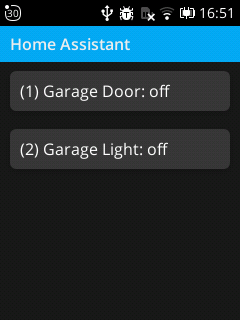

# KaiOS Home Assistant

Simple KaiOS application that allows calling home assistant services by button click.
Will add more features and UI stuff if I have the time/need it. Open for collaboration, PR's are welcome!

Only setup needed is creating an env.js file just like env.example.js. In docker/ there is a CORS proxy server because I couldn't make direct requests to HA RESTful API during development without any CORS shenanigans... (I'm using NGINX reverse proxy addon, maybe that's one of the reasons).

This project was based on [kaiostech/sample-vanilla](https://github.com/kaiostech/sample-vanilla).

## Available Scripts

### `npm run start` or `yarn start`

Runs the app in the development mode.

### `npm run build` or `yarn build`

Builds the app for production to the `build` folder.
