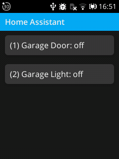

# KaiOS Home Assistant

A [Home Assistant](https://www.home-assistant.io/) remote for KaiOS feature phones —
control your lights, switches, scripts, covers and more from the keypad.



> _Screenshot is of the original prototype. The app is being redesigned (multi-server, a
> custom grid dashboard with D-pad navigation, per-domain detail screens). See **Roadmap**._

## Status

Mid-redesign. The **foundation** has landed: a modern build pipeline plus the UI-free core
(runtime config, entity-state cache, HA REST client, per-domain registry). The new dashboard UI
is in progress.

## Architecture

Vanilla TypeScript, no UI framework (the target engine is old and bundle size / battery matter).
Bundled with [esbuild](https://esbuild.github.io/), tested with [Vitest](https://vitest.dev/).

| Module | Responsibility |
|---|---|
| `src/store/` | Config persisted to `localStorage` (servers, pages, settings) + a live entity-state cache. |
| `src/ha/` | Home Assistant REST client over mozSystem `XMLHttpRequest` (`getStates`, `callService`, `ping`). |
| `src/domains/` | Per-domain registry: icon, state formatting, primary action, detail controls. |

The HA client is UI-free and transport-isolated, so a future WebSocket transport can replace it
without touching the rest of the app.

## Getting started

Requires **Node 20+**.

```sh
npm install
npm run dev      # esbuild dev server on http://localhost:1234 (+ starts the CORS proxy)
```

### Scripts

| Script | Does |
|---|---|
| `npm run dev` | Start the CORS proxy and an esbuild watch + serve dev server. |
| `npm run build` | Production bundle into `build/` (target `es2015` for Gecko 48, IIFE). |
| `npm run package` | `build` + zip `build/` into `application.zip` (for make-kaios-install / OmniSD). |
| `npm run flash` | `build` + install to a connected KaiOS device via gdeploy (see Deploying). |
| `npm run typecheck` | `tsc --noEmit`. |
| `npm test` | Run the Vitest suite. |

## Configuration

There is **no `env.js` file** anymore. Servers (URL + long-lived token) are configured at runtime
and stored in the device's `localStorage` — nothing secret lives in the source or the build
artifact. (The in-app settings UI lands with the dashboard; see Roadmap.)

### CORS during development

On a real device, KaiOS's `mozSystem` XHR bypasses CORS, so no proxy is needed. On the desktop
dev server it is, so `npm run dev` starts the small Flask proxy in `docker/`. See
[`docker/README.md`](./docker/README.md).

## Deploying to a device (no old Firefox needed)

WebIDE (the classic install GUI) requires an old Firefox / Waterfox. You can skip it entirely —
installation goes over the **KaiOS remote debugging protocol** via ADB. [gdeploy](https://gitlab.com/suborg/gdeploy)
(a Node.js client) is bundled as a dev dependency and wrapped in `npm run flash`.

1. On the phone, enable debugging: dial `*#*#33284#*#*` and choose **"ADB and DevTools"** (a bug
   icon appears in the status bar).
2. Connect the phone and confirm with Android platform-tools: `adb devices` should list it. If you
   have **other** devices plugged in (e.g. an Android phone), either unplug them or pin the target
   with `export ANDROID_SERIAL=<kaios-serial>` — gdeploy targets one device at a time.
3. Flash it:
   ```sh
   npm run flash
   ```
   Accept the **"remote debugging"** prompt on the phone the first time. Then `npx gdeploy list`
   shows installed apps and `npx gdeploy start <manifestUrl>` launches one.

`npm run flash` runs `gdeploy install build` under the hood — gdeploy zips the `build/` **directory**
itself (it needs the system `zip` and `adb` tools installed). The separate `application.zip` from
`npm run package` is for the other installers below, not gdeploy.

Other routes (no Firefox either):
- [**make-kaios-install**](https://github.com/sunsetsonwheels/make-kaios-install) — Makefile +
  XPCShell + ADB; installs `application.zip`.
- [**OmniSD**](https://wiki.bananahackers.net/development/webide) — install packaged zips straight
  from the phone's storage, no PC at all.

The app's manifest is `privileged`, which installs fine as a sideloaded debug app (no store
signing required).

## Debugging

Quick, dependency-free options (no old Firefox):

- **`adb logcat`** — `console.log`, JS exceptions and Gecko errors stream here:
  ```sh
  adb logcat | grep -iE "Gecko|Console|JavaScript"
  ```
- **`gdeploy evaluate`** — run JS in the live app context as a REPL:
  ```sh
  npx gdeploy evaluate <manifestUrl> "console.log(document.title)"
  ```
- **On-screen console** — an in-page DevTools overlay like
  [Eruda](https://github.com/liriliri/eruda) or [vConsole](https://github.com/Tencent/vConsole)
  renders a console / network / DOM inspector on the device itself (pick a version compatible with
  Gecko 48).

For the full GUI DevTools against the real device, use Waterfox Classic — see below.

## Local development with Waterfox Classic

Modern Firefox and Chrome dropped both WebIDE and support for Gecko 48, so they can neither run the
app in a representative engine nor remote-debug the device. [**Waterfox Classic**](https://classic.waterfox.net/)
is a maintained fork of legacy Firefox (≈ FF 56 ESR) that keeps WebIDE and the legacy DevTools — the
one desktop browser that can still do both:

- **Run the app in an old-Gecko engine** — open `build/index.html` (after `npm run build`) or the
  dev server (`npm run dev` → `http://localhost:1234`) in Waterfox Classic to catch compatibility
  problems far closer to the device than a modern browser would.
- **WebIDE remote debugging** — open WebIDE (`Tools → Web Developer → WebIDE`, or `Shift+F8`),
  add the phone as a Remote Runtime over ADB, then install / inspect / debug with the full DevTools
  suite (DOM inspector, JS debugger, console, network monitor) — richer than logcat or an on-screen
  overlay.

Optional: the CLI flow above (`npm run flash` + `adb logcat` / `gdeploy evaluate`) covers install
and debugging without it.

## Roadmap

- [x] Foundation — esbuild + Vitest, config store, HA REST client, domain registry
- [ ] Navigation framework + grid dashboard (D-pad, softkeys, live polling)
- [ ] Per-domain detail screens (covers, climate, dimmable lights)
- [ ] Settings + multi-server management + quick-switch
- [ ] Entity discovery + in-app picker + page management
- [ ] Polish — toasts, icons, i18n, docs

## Credits

Originally based on [kaiostech/sample-vanilla](https://github.com/kaiostech/sample-vanilla).
PRs welcome.
